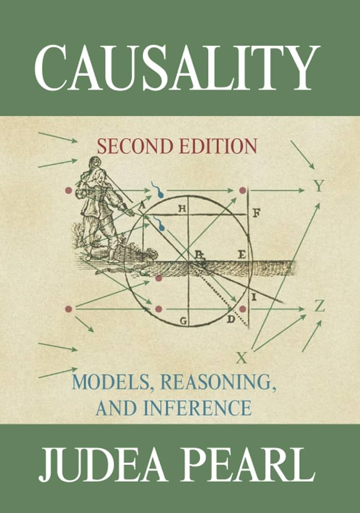
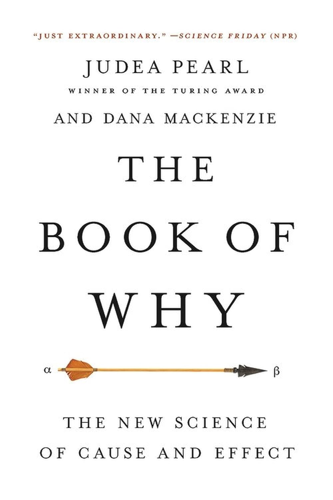

# Welcome {.section-slide}

::: {.notes}
- welcome everyone
- thank them for being there
:::

## {background-image="images/illustrations-undraw/undraw_online-meeting_qe61.svg" background-size="contain-padded-15"}

::: {.notes}
- one sentence on who you are
  - studied psychology
  - last year phd in psych methods
:::

## {background-image="images/illustrations-undraw/undraw_goal_rulh.svg" background-size="contain-padded-15"}

::: {.notes}
- one or two sentences on the goal of the workshop
  - accessible introduction to (graphical) causal inference
- set tone:
  - lets be interactive
  - no pressure
  - we go slow
  - you have time
  - ask all kinds of questions
  - everybody benefits from every question
  - this is difficult material
    - dont expect to understand everything
    - give yourself time
    - if you are confused, it means you are paying attention
- you get all of the material
- you get further reading material
:::

## {background-image="images/illustrations-undraw/undraw_conversation_15p8.svg" background-size="contain-padded-15"}

::: {.notes}
- name, role, context (research / practice)
- what outcome/topic they care about
- what they hope to take away
:::

## {background-iframe="https://moritzketzer.github.io/iqb-workshop/" background-interactive="true"}

::: {.notes}
Walk through the website together: Zoom info, presentations, RStudio server setup, resources.
:::

## Workshop Website and RStudio Server Setup {.v-center}

[**moritzketzer.github.io/iqb-workshop**](https://moritzketzer.github.io/iqb-workshop/){target="_blank"}

::: {.notes}
- open the workshop website — type the URL or click the link
- under "RStudio Server": first claim a login, then open RStudio
- you get a username from a famous statistician or causal inference researcher
- password is changeme
- hello-world.R is in your home directory — run it to check everything works
- we will use this for the R exercises later
:::

# Why bother with Causal Inference? {.section-slide}

## {background-image="images/papershots/messerli-2012-nejm-p1563-chocolate-nobel-scatterplot.png" background-size="contain-padded-6"}

::: {.citation-lower-left}
@messerliChocolateConsumptionCognitive2012
:::

## {background-color="teal"}

```{=html}
<div class="label-stack">
<span>Descriptive</span>
<hr>
<span>Predictive</span>
<hr>
<span>Explanatory</span>
</div>
```

## {background-image="images/plots/chocolate-nobel-describe.png" background-size="contain-padded-6"}

## {background-image="images/plots/chocolate-nobel-predict.png" background-size="contain-padded-6"}

## {background-image="images/plots/chocolate-nobel-explain.png" background-size="contain-padded-6"}

## {background-image="images/papershots/vigen-spurious-correlations-margot-robbie-firefighters.png" background-size="contain-padded-4"}

::: {.citation-lower-left .website}
@SpuriousCorrelations
:::

## {background-image="images/papershots/vigen-spurious-scholar-ballad-of-bailey.png" background-size="contain-padded-4"}

::: {.citation-lower-left .website}
@SpuriousScholar
:::

## {background-image="images/papershots/shmueli-2010-tep-p289-title-abstract.png" background-size="contain-padded-10"}

::: {.citation-lower-left}
@shmueliExplainPredict2010a
:::

## {background-image="images/papershots/editorial-2021-nhb-v5-p1261-description-prediction-explanation.png" background-size="contain-padded-2"}

::: {.citation-lower-left}
@DescriptionPredictionExplanation2021
:::

## Kidney Stones {.quote-slide}

::: {.label-stack-small}
Two treatments

---

Which one is better?
:::

::: {.citation-lower-left}
@charigComparisonTreatmentRenal1986
:::

::: {.notes}
Transition from spurious correlations → what about non-obvious cases?
Real data. Open surgery (A) vs less invasive (B). 700 patients.
:::

## {.center}

```{r}
#| echo: false
library(gt)

tibble::tribble(
  ~size,    ~trt_a,               ~trt_b,
  "Small",  "81 / 87 (93%)",     "234 / 270 (87%)",
  "Large",  "192 / 263 (73%)",   "55 / 80 (69%)",
  "Total",  "273 / 350 (78%)",   "289 / 350 (83%)"
) |>
  gt() |>
  cols_label(size = "Stone size", trt_a = "Treatment A", trt_b = "Treatment B") |>
  tab_style(
    style = list(cell_borders(sides = "top", color = "grey50", weight = px(1.5)),
                 cell_text(weight = "bold")),
    locations = cells_body(rows = size == "Total")
  ) |>
  tab_options(
    table.font.size = px(32),
    column_labels.font.size = px(28),
    column_labels.font.weight = "bold",
    table.border.top.style = "none",
    table.border.bottom.style = "none",
    column_labels.border.bottom.color = "grey50",
    table_body.hlines.style = "none",
    table.width = pct(80),
    table.align = "center"
  )
```

::: {.notes}
Table has the full story already. Don't spoil — let them read.
A wins both subgroups, B wins overall. Paradox.
:::

## {background-image="images/plots/kidney-bars-overall.png" background-size="contain-padded-6"}

::: {.notes}
Treatment A (open surgery): 78%. Treatment B (less invasive): 83%.
B looks better. Should we recommend B?
:::

## {background-image="images/plots/kidney-bars-by-size.png" background-size="contain-padded-6"}

::: {.notes}
By stone size:
- Small: A 93% vs B 87%
- Large: A 73% vs B 69%
A wins BOTH. Overall was misleading → Simpson's paradox.
:::

## {background-image="images/plots/kidney-waffle.png" background-size="contain-padded-6"}

::: {.notes}
Panel sizes = allocation. A got mostly large (hard), B got mostly small (easy).
Severity drove assignment AND outcome → confounding.
Stratify → A genuinely better. But how do we *know* when to stratify?
:::

::: {.citation-lower-left}
@pearlUnderstandingSimpsonsParadox2013; @kievitSimpsonsParadoxPsychological2013
:::

## Why? {.quote-slide}

> Stone size influences **both** which treatment you get **and** how well you recover.

## {background-image="images/dags/dag-fork-confounder.svg" background-size="contain-padded-6"}

::: {.fragment .absolute bottom="5%" left="0%" right="0%" style="text-align: center;"}
[**✓ Stratify!**]{style="background:#009E73; color:white; padding:0.3em 1.4em; border-radius:6px; font-size:1.6em;"}
:::

## {.center}

```{r}
#| echo: false
tibble::tribble(
  ~bp,        ~drug,               ~nodrug,
  "Low BP",   "81 / 87 (93%)",    "234 / 270 (87%)",
  "High BP",  "192 / 263 (73%)",  "55 / 80 (69%)",
  "Total",    "273 / 350 (78%)",  "289 / 350 (83%)"
) |>
  gt() |>
  cols_label(
    bp     = md("Blood pressure<br>*(measured after)*"),
    drug   = "Drug",
    nodrug = "No drug"
  ) |>
  tab_style(
    style = list(cell_borders(sides = "top", color = "grey50", weight = px(1.5)),
                 cell_text(weight = "bold")),
    locations = cells_body(rows = bp == "Total")
  ) |>
  tab_options(
    table.font.size = px(32),
    column_labels.font.size = px(28),
    column_labels.font.weight = "bold",
    table.border.top.style = "none",
    table.border.bottom.style = "none",
    column_labels.border.bottom.color = "grey50",
    table_body.hlines.style = "none",
    table.width = pct(80),
    table.align = "center"
  )
```

::: {.notes}
Identical numbers — just relabeled.
BP measured AFTER treatment → consequence of drug, not prior cause.
Drug wins both BP subgroups. No drug wins overall. Same paradox, opposite correct answer.
:::

## {background-image="images/dags/dag-chain-mediator.svg" background-size="contain-padded-6"}

::: {.fragment .absolute bottom="5%" left="0%" right="0%" style="text-align: center;"}
[**✗ Don't stratify!**]{style="background:#D55E00; color:white; padding:0.3em 1.4em; border-radius:6px; font-size:1.6em;"}
:::

::: {.notes}
BP on causal path, not common cause. Chain, not fork.
Stratify by BP → filter out mechanism → drug looks useless.
Aggregate correct here: drug helps THROUGH lowering BP.
:::

## Same data. Opposite answers. {.quote-slide}

> The statistics are identical.
>
> Only the **causal story** changed.

::: {.notes}
Key slide.
Kidney: common cause → stratify. BP: consequence → don't stratify.
Same table, opposite correct answers. Statistics alone can't resolve this.
Need causal structure → transition to "what IS causal inference?"
:::

<!-- μ-reset: Stand up, stretch, breathe. Let the kidney stones example settle. Same numbers — opposite conclusions. What was the difference? Let your mind wander. Any questions forming? -->

##

::: {.books-container}



:::

::: {.citation-lower-left}
@pearlCausalityModelsReasoning2009; @pearlBookWhyNew2018
:::

::: {.notes}
Largely because of this guy — Judea Pearl. "Causality" (2009, technical) and "The Book of Why" (2018, accessible).
Pearl formalized the graphical approach: encode causal assumptions in a graph, then read off what's identifiable.
:::

## {background-image="images/illustrations/pearl-2018-bow-fig1-2-ladder-of-causation.png" background-size="contain-padded-2"}

::: {.citation-lower-left}
@pearlBookWhyNew2018 [fig. 1.2]
:::

::: {.notes}
Three rungs: seeing, doing, imagining. Can't climb with data alone.
Dog: "Owners are happier" → "Would getting one make ME happier?" → "Would I still be happy WITHOUT it?"
Today: rung 1 → 2. But first, rung 3 — why it's hard.
:::

## Rung 3: Imagining {.center}

::: {.fragment}
You got a dog. You're happy.

$$Y_i(\text{dog}) = 1 \quad \checkmark$$
:::

::: {.fragment}
Would you have been happy [without]{.red} the dog?

$$Y_i(\text{no dog}) = \; ?$$
:::

::: {.notes}
Two scenarios: Y(no dog)=1 → dog didn't matter. Y(no dog)=0 → dog caused it.
Can't rewind time. Every causal question has this structure.
:::

## The Individual Treatment Effect {.center}

::: {.citation-lower-left}
@rubinEstimatingCausalEffects1974
:::

::: {.fragment}
$$\tau_i = Y_i(1) - Y_i(0)$$
:::

::: {.fragment style="text-align:center; margin-top:1.5em;"}
[**We can never observe both for the same person.**]{style="background:var(--iqb-accent); color:white; padding:0.3em 1.4em; border-radius:6px; font-size:1.1em;"}
:::

::: {.notes}
Holland (1986): fundamental problem of causal inference.
Not statistics — metaphysics. Can't be in two states at once.
:::

## The Fundamental Problem of Causal Inference {.center}

| $i$ | $T$ | $Y$ | $Y(1)$ | $Y(0)$ | $\tau_i$ |
|:---:|:---:|:---:|:-------:|:-------:|:--------:|
| 1   | 0   | 0   | ?       | 0       | ?        |
| 2   | 1   | 1   | 1       | ?       | ?        |
| 3   | 1   | 0   | 0       | ?       | ?        |
| 4   | 0   | 0   | ?       | 0       | ?        |
| 5   | 0   | 1   | ?       | 1       | ?        |
| 6   | 1   | 1   | 1       | ?       | ?        |

::: {.notes}
Missing data problem — not measurement failure, but metaphysics. Half the table always missing.
So what CAN we do?
:::

::: {.citation-lower-left}
@hollandStatisticsCausalInference1986
:::

## From Individual to Average {.quote-slide}

We [**can't know**]{style="color:var(--iqb-accent);"} $\tau_i$ for any single person.

::: {.fragment style="margin-top:0.5em;"}
But we can ask about the [**average**]{style="color:var(--iqb-accent);"} across many people:

$$\begin{aligned}
ATE &= \mathbb{E}[Y(1) - Y(0)] \\
    &= \mathbb{E}[Y(1)] - \mathbb{E}[Y(0)]
\end{aligned}$$
:::

::: {.fragment style="text-align:center; margin-top:0.5em;"}
[Rung 3 → Rung 2]{style="background:var(--iqb-accent); color:white; padding:0.3em 1.4em; border-radius:6px; font-size:1.1em;"}
:::

::: {.notes}
Give up on individual → ask about the average. This is what RCTs target.
Distribute expectation → two population means we can estimate separately.
Key question: how do we estimate this from observational data?
:::

## {#observing-vs-intervening .center}

:::: {.columns style="justify-content:center; gap:3em; margin-top:2em;"}
::: {.column style="width:46%; text-align:center; border:2px solid var(--iqb-accent); border-radius:10px; background:var(--iqb-accent-soft); padding:1em 1.5em;"}

[Observational]{style="font-size:1.1em; color:var(--iqb-accent); text-transform:uppercase; letter-spacing:0.08em; display:block; border-bottom:2px solid var(--iqb-accent); padding:0.35em 0; margin-bottom:0.3em;"}

$$
\mathbb{E}[Y \mid X = x]
$$

["What $Y$ do we **see** when $X = x$?"]{style="font-size:0.85em; color:var(--iqb-muted);"}

:::
::: {.column style="width:46%; text-align:center; border:2px solid var(--iqb-accent); border-radius:10px; background:var(--iqb-accent-soft); padding:1em 1.5em;"}

[Interventional]{style="font-size:1.1em; color:var(--iqb-accent); text-transform:uppercase; letter-spacing:0.08em; display:block; border-bottom:2px solid var(--iqb-accent); padding:0.35em 0; margin-bottom:0.3em;"}

$$\mathbb{E}[Y \mid \text{do}(X = x)]$$

["What $Y$ do we **get** when we **set** $X = x$?"]{style="font-size:0.85em; color:var(--iqb-muted);"}

:::
::::

::: {.fragment style="text-align:center; margin-top:2em;"}
[**When are these equal?**]{style="background:var(--iqb-accent); color:white; padding:0.3em 1.6em; border-radius:6px; font-size:1.3em;"}
:::

::: {.notes}
Left = rung 1, right = rung 2. Differ whenever there's confounding.
Dog: owners are happier ≠ getting a dog makes you happier. Maybe happy people get dogs.
This question drives everything today.
:::

## {background-image="images/illustrations-custom/neal-2020-fig4-2-conditioning-vs-intervening.svg" background-size="contain-padded-2"}

::: {.citation-lower-left}
@nealIntroductionCausalInferencea [fig. 4.2]
:::

::: {.notes}
Conditioning = filter operation. Pick the subgroup where T=1 — self-selected, may differ systematically.
Intervening = force everyone into treatment. No self-selection.
Conditioning ≠ intervening when there's confounding.
:::

## Structural Causal Models {.center}

::: {.citation-lower-left}
@pearlCausalInferenceStatistics2016
:::

$$\mathcal{M} = \langle U, V, F, P(U) \rangle$$

::: {.fragment}
:::: {.scm-box}

|           |                                                                   |
|----------:|:------------------------------------------------------------------|
| $V$       | endogenous variables (what we model)                              |
| $U$       | exogenous variables (background factors, error terms)             |
| $F$       | structural functions (how each $V$ is determined by its parents + $U$) |
| $P(U)$    | probability distribution over the exogenous variables             |

::::
:::

::: {.notes}
"The causal story has a formal name" (Pearl, Glymour & Jewell 2016). All four parts in kidney stones:

— V: treatment, stone size, recovery.
— U: patient genetics, lifestyle, surgeon skill — everything else.
— F: how stone size determines treatment assignment, how both determine recovery.
— P(U): distribution over background factors — makes the model probabilistic.

Every SCM implies a DAG -> tells us what to adjust for.

For SEM users: SEM is an SCM with linear F and normal U.
Same object, specific assumptions.
:::

## An SCM Example

::::: {.columns}
:::: {.column width="50%"}

### Structural Equations

$$
\begin{aligned}
Z &\leftarrow f_Z(U_Z) \\
X &\leftarrow f_X(Z, U_X) \\
Y &\leftarrow f_Y(Z, X, U_Y)
\end{aligned}
$$

### Distributional Assumptions

$$
U_Z, U_X, U_Y \overset{\text{ind.}}{\sim} P(U)
$$

::::

:::: {.column width="50%"}
{.absolute top="30" right="5" height="400"}
::::
:::::

::: {.notes}
Concrete example: Z confounder, X treatment, Y outcome. Each has its own U.
U's usually omitted from DAGs — shown here to connect to formal definition.
:::

## Graph Surgery

::::: {.columns}
:::: {.column width="50%"}

### Structural Equations

$$
\begin{aligned}
Z &\leftarrow f_Z(U_Z) \\
X &\leftarrow \color{#107895}{x} \\
Y &\leftarrow f_Y(Z, \textcolor{#107895}{x}, U_Y)
\end{aligned}
$$

### Distributional Assumptions

$$
U_Z, \textcolor{lightgray}{U_X}, U_Y \overset{\text{ind.}}{\sim} P(U)
$$

::::

:::: {.column width="50%"}
{.absolute top="30" right="5" height="400"}
::::
:::::

::: {.notes}
do-operator = graph surgery. Replace X's equation with a constant, cut incoming arrows.
Downstream (Y) keeps its equation. Upstream (Z) unaffected. U_X irrelevant.
Key: this is NOT conditioning — conditioning doesn't remove arrows.
ATE: E[Y|do(X=1)] - E[Y|do(X=0)] = "what happens when we surgically set X to 1 vs 0?"
:::

## A Linear SCM

::::: {.columns}
:::: {.column width="50%"}

### Structural Equations

$$
\begin{aligned}
Z &= U_Z \\
X &= \beta^{XZ} Z + U_X \\
Y &= \beta^{YX} X + \beta^{YZ} Z + U_Y
\end{aligned}
$$

### Distributional Assumptions

$$
\begin{pmatrix} U_Z \\ U_X \\ U_Y \end{pmatrix} \sim \mathcal{N}\left(\begin{pmatrix} 0 \\ 0 \\ 0 \end{pmatrix}, \begin{pmatrix} \sigma^2_Z & 0 & 0 \\ 0 & \sigma^2_X & 0 \\ 0 & 0 & \sigma^2_Y \end{pmatrix}\right)
$$
::::

:::: {.column width="50%"}
{.absolute top="30" right="5" height="400"}
::::
:::::

::: {.notes}
Special case SEM users know. β's ARE the causal effects.
Diagonal covariance = independent errors = no unmeasured common causes beyond what's modeled.
:::

## Graph Surgery: Linear Case

::::: {.columns}
:::: {.column width="50%"}

### Structural Equations

$$
\begin{aligned}
Z &= U_Z \\
X &= \color{#107895}{x} \\
Y &= \beta^{YX} \textcolor{#107895}{x} + \beta^{YZ} Z + U_Y
\end{aligned}
$$

### Distributional Assumptions

$$
\begin{pmatrix} U_Z \\ \textcolor{lightgray}{U_X} \\ U_Y \end{pmatrix} \sim \mathcal{N}\left(\begin{pmatrix} 0 \\ \textcolor{lightgray}{0} \\ 0 \end{pmatrix}, \begin{pmatrix} \sigma^2_Z & 0 & 0 \\ 0 & \textcolor{lightgray}{\sigma^2_X} & 0 \\ 0 & 0 & \sigma^2_Y \end{pmatrix}\right)
$$
::::

:::: {.column width="50%"}
{.absolute top="30" right="5" height="400"}
::::
:::::

::: {.notes}
ATE in linear SCM = β^{YX}. The path coefficient IS the causal effect.
SEM users have been estimating causal effects all along — just needed the graph to justify it.
:::

## Estimand in do notation {.center}

$$ATE = \mathbb{E}[Y \mid do(X=1)] - \mathbb{E}[Y \mid do(X=0)]$$

::: {.notes}
do(X=1) = "set X to 1", not "observe X = 1". Same target as E[Y(1)-Y(0)], different notation.
Pearl connects to graphs, Rubin to experiments.
:::

## {background-image="images/plots/ate-generality-binary.png" background-size="contain-padded-6"}

::: {.notes}
Binary case — textbook RCT. ATE = difference in group means under intervention.
:::

## Estimand in do notation {.center}

$$ATE = \mathbb{E}[Y \mid do(X=x')] - \mathbb{E}[Y \mid do(X=x)]$$

::: {.notes}
Generalized: any two values x' vs x, not just 0/1.
:::

## {background-image="images/plots/ate-generality-linear.png" background-size="contain-padded-6"}

::: {.notes}
Continuous X, linear effect. Slope = β from the linear SCM. One number everywhere.
:::

## {background-image="images/plots/ate-generality-nonlinear.png" background-size="contain-padded-6"}

::: {.notes}
Nonlinear: effect depends on where you are. No single number.
do-operator still well-defined — just varies by location.
:::

## {background-image="images/plots/ate-generality-projection.png" background-size="contain-padded-6"}

::: {.notes}
Linear projection = weighted average of local effects. Hides heterogeneity.
We work linear today — framework is more general than models we fit.
:::

## Two Frameworks, One Estimand {.center}

\

### Potential Outcomes (Rubin)

$$
ATE = \mathbb{E}[Y_i(1) - Y_i(0)]
$$

\

### Structural Causal Model (Pearl)

$$
ATE = \mathbb{E}[Y \mid do(X=1)] - \mathbb{E}[Y \mid do(X=0)]
$$

::: {.notes}
Two traditions, same target.
:::

## One Estimand, three expressions {.center}

$$
\begin{aligned}
ATE &= \mathbb{E}[Y_i(1) - Y_i(0)] \\
    &= \mathbb{E}[f_Y(1, \mathbf{U}_i) - f_Y(0, \mathbf{U}_i)] \\
    &= \mathbb{E}[Y \mid do(X=1)] - \mathbb{E}[Y \mid do(X=0)]
\end{aligned}
$$

::: {.notes}
Potential outcomes = structural equations evaluated in the mutilated model.
Y_i(x) = f_Y(x, U_i) — that's the middle line.
Linear case: everything cancels, ATE = β^{YX}.
:::

# Directed Acyclic Graphs (DAGs) {.section-slide}

::: {.notes}
Nodes = variables. Arrows = direct causal effects. Acyclic = no loops.
Encodes assumptions — including what's NOT connected. Absence of arrow = no direct effect.
:::

## {background-image="images/papershots/wright-1920-pnas-fig1-piebald-guinea-pig-path-diagram.png" background-size="contain-padded-2"}

::: {.citation-lower-left}
@wrightRelativeImportanceHeredity1920 [fig. 1]
:::

::: {.notes}
Sewall Wright, 1920 — the first path diagram. Guinea pig coat color.
If you've drawn a path diagram, you've already drawn a DAG.
:::

## {background-image="images/papershots/wright-1934-mpc-p1-title-page.png" background-size="contain-padded-2"}

::: {.citation-lower-left}
@wrightMethodPathCoefficients1934
:::

::: {.notes}
Wright formalized path coefficients in 1934. Direct ancestor of SEM.
Pearl added the formal rules for what you can and can't conclude. Now: three building blocks.
:::

# The Three Elemental Structures {.section-slide}

## Fork (Common Cause) {.center .section-slide}

::: {.notes}
Title slide — name the structure, then advance to the interactive demo.
Fork: $Z$ causes both $X$ and $Y$. Spurious association disappears when you condition on $Z$.
:::

##

```{=html}
<div class="bayes-ball-widget"
     data-nodes='[{"id":"X","label":"X","x":200,"y":280},{"id":"Z","label":"Z","x":400,"y":80},{"id":"Y","label":"Y","x":600,"y":280}]'
     data-edges='[["Z","X"],["Z","Y"]]'
     data-source="X"
     data-target="Y">
</div>
```

::: {.notes}
Interactive fork demo.
Default: run → d-connected (ball passes through unobserved Z).
Condition on Z → d-separated (ball blocked by observed non-collider).
Key: this is why we "control for confounders."
:::

## {background-image="images/plots/fork-simpsons-aggregate.png" background-size="contain-padded-6"}

::: {.notes}
Simulated data from a fork SCM. Looks like one homogeneous cloud.
Ask: "What's the relationship between X and Y?"
Let them say "negative." Then advance.
:::

## {background-image="images/plots/fork-simpsons-2bins.png" background-size="contain-padded-6"}

::: {.notes}
Same data — split Z at the median into two groups.
Within each group: positive slope. Aggregate: still negative.
Simpson's paradox appears. But two bins is coarse.
:::

## {background-image="images/plots/fork-simpsons-3bins.png" background-size="contain-padded-6"}

::: {.notes}
Pattern solidifies — all three upward. Aggregate is the outlier.
:::

## {background-image="images/plots/fork-simpsons-4bins.png" background-size="contain-padded-6"}

::: {.notes}
Same story, finer bins. Building toward the limit.
:::

## {background-image="images/plots/fork-simpsons-5bins.png" background-size="contain-padded-6"}

::: {.notes}
Five bins, all positive. Finer conditioning, same result.
:::

## {background-image="images/plots/fork-simpsons-10bins.png" background-size="contain-padded-6"}

::: {.notes}
Dense fan of positive slopes. Aggregate still negative — that's the confounding.
:::

## {background-image="images/plots/fork-simpsons-continuous.png" background-size="contain-padded-6"}

::: {.absolute .dgp-overlay top="0" left="0"}
```r
Z <- runif(n, 0, 10)
X <- 0.6 * Z + rnorm(n, mean = 0, sd = 2)
Y <- 1.0 * X - 2.0 * Z
    + rnorm(n, mean = 0, sd = 1.5)
```
:::

::: {.notes}
Conditioning taken to the limit. At any fixed Z, X-Y positive.
Aggregate trend = confounding. "Controlling for confounder" = comparing within Z-slices.
:::

## Chain (Mediator) {.center .section-slide}

::: {.notes}
Title slide — name the structure, then advance to the interactive demo.
Chain: $X$ causes $Z$ causes $Y$. Conditioning on $Z$ blocks the causal path.
:::

##

```{=html}
<div class="bayes-ball-widget"
     data-nodes='[{"id":"X","label":"X","x":180,"y":190},{"id":"Z","label":"Z","x":400,"y":190},{"id":"Y","label":"Y","x":620,"y":190}]'
     data-edges='[["X","Z"],["Z","Y"]]'
     data-source="X"
     data-target="Y">
</div>
```

::: {.notes}
Interactive chain demo.
Default: run → d-connected (causal path is open).
Condition on Z → d-separated (blocking the mediator).
Key: controlling for a mediator removes the causal effect — don't do it.
:::

## {background-image="images/plots/chain-binary-marginal.png" background-size="contain-padded-6"}

::: {.absolute .dgp-overlay top="0" left="0"}
```r
tutoring <- rnorm(n, mean = 5, sd = 2)
homework <- rbinom(n, 1,
    plogis(tutoring - 5))
scores <- 20 * homework
        + rnorm(n, mean = 50, sd = 8)
```
:::

::: {.notes}
Tutoring → Homework → Scores. Aggregate: positive slope.
Ask: "Homework correlates with both. Should we control for it?" They'll say yes — it's a trap.
:::

## {background-image="images/plots/chain-binary-conditioned.png" background-size="contain-padded-6"}

::: {.absolute .dgp-overlay top="0" left="0"}
```r
tutoring <- rnorm(n, mean = 5, sd = 2)
homework <- rbinom(n, 1,
    plogis(tutoring - 5))
scores <- 20 * homework
        + rnorm(n, mean = 50, sd = 8)
```
:::

::: {.notes}
Controlling for homework: within each group, flat. Tutoring works THROUGH homework.
Dashed = total effect. Controlling killed it. This is overcontrol bias.
:::


## Collider {.center .section-slide}

::: {.citation-lower-left}
@elwertEndogenousSelectionBias2014
:::

::: {.notes}
Title slide — name the structure, then advance to the interactive demo.
Collider: both $X$ and $Y$ cause $Z$. Conditioning OPENS a spurious path.
:::

##

```{=html}
<div class="bayes-ball-widget"
     data-nodes='[{"id":"X","label":"X","x":200,"y":80},{"id":"Z","label":"Z","x":400,"y":280},{"id":"Y","label":"Y","x":600,"y":80}]'
     data-edges='[["X","Z"],["Y","Z"]]'
     data-source="X"
     data-target="Y">
</div>
```

::: {.notes}
Interactive collider demo.
Default: run → d-separated (no path between independent causes).
Condition on Z → d-connected (collider bias — conditioning opens the path).
The counterintuitive case. Let audience verify it themselves.
:::

## {background-image="images/plots/collider-full.png" background-size="contain-padded-6"}

::: {.absolute .dgp-overlay top="0" left="0"}
```r
talent   <- rnorm(n, mean = 0, sd = 1)
beauty   <- rnorm(n, mean = 0, sd = 1)
celebrity <- talent + beauty
```
:::

::: {.notes}
Talent and beauty independent in population. Flat line.
Ask: "What if we only look at celebrities?"
:::

## {background-image="images/plots/collider-selected.png" background-size="contain-padded-6"}

::: {.absolute .dgp-overlay top="0" left="0"}
```r
talent   <- rnorm(n, mean = 0, sd = 1)
beauty   <- rnorm(n, mean = 0, sd = 1)
celebrity <- talent + beauty
# Top 15% become famous
celeb <- celebrity > P85
```
:::

::: {.notes}
Among celebrities: strong negative slope. "Famous but can't act — must be the looks."
Explaining away. Phantom association — doesn't exist in the population.
:::

## {background-image="images/plots/collider-gradient.png" background-size="contain-padded-6"}

::: {.absolute .dgp-overlay top="0" left="0"}
```r
talent   <- rnorm(n, mean = 0, sd = 1)
beauty   <- rnorm(n, mean = 0, sd = 1)
celebrity <- talent + beauty
```
:::

::: {.notes}
Not a threshold artifact — structural. At every level of fame, negative association.
:::

## Collider (Descendant) {.center .section-slide}

::: {.notes}
Same collider, but now: what about something DOWNSTREAM of the collider?
You know not to condition on Celebrity. But what about Instagram followers?
:::

##

```{=html}
<div class="bayes-ball-widget"
     data-nodes='[{"id":"X","label":"X","x":200,"y":60},{"id":"Y","label":"Y","x":600,"y":60},{"id":"Z","label":"Z","x":400,"y":185},{"id":"W","label":"W","x":400,"y":328}]'
     data-edges='[["X","Z"],["Y","Z"],["Z","W"]]'
     data-source="X"
     data-target="Y">
</div>
```

::: {.notes}
Condition on W (not Z!) → still d-connected.
W = Followers, a consequence of Celebrity. Conditioning still partially opens the path.
:::

## {background-image="images/plots/collider-descendant.png" background-size="contain-padded-6"}

::: {.absolute .dgp-overlay top="0" left="0"}
```r
talent   <- rnorm(n, mean = 0, sd = 1)
beauty   <- rnorm(n, mean = 0, sd = 1)
celebrity <- talent + beauty
followers <- 0.8 * celebrity
            + rnorm(n, mean = 0, sd = 1.2)
```
:::

::: {.notes}
"You just study actors with >100k followers." Noisy proxy for Celebrity.
Negative slope weaker but still there. Bias attenuated, not eliminated.
:::

## Putting It Together {.center .section-slide}

::: {.notes}
Title slide — transition from elemental structures to a realistic graph
where multiple structures overlap and interact.
:::

##

```{=html}
<div class="bayes-ball-widget"
     data-nodes='[{"id":"A","label":"A","x":120,"y":60},{"id":"B","label":"B","x":580,"y":60},{"id":"C","label":"C","x":350,"y":170},{"id":"X","label":"X","x":120,"y":340},{"id":"Y","label":"Y","x":580,"y":340},{"id":"Z","label":"Z","x":350,"y":470}]'
     data-edges='[["A","C"],["A","X"],["B","C"],["B","Y"],["C","X"],["C","Y"],["X","Y"],["X","Z"],["Y","Z"]]'
     data-source="X"
     data-target="Y">
</div>
```

::: {.notes}
Multiple paths from X to Y. Let them explore: which nodes to condition on?
This is where intuition needs algorithms.
:::

# D-Separation {.section-slide}

::: {.citation-lower-left}
@pearlCausalityModelsReasoning2009
:::

::: {.notes}
"You just did this intuitively. Now let's name the rule."
Synthesis moment, not new content.
:::

## Directed Separation {.center}

A path between X and Y is **blocked** given a conditioning set **Z** if it contains:

::: {.fragment}
::::: {.scm-box}

|     |                                                                        |
|----:|:-----------------------------------------------------------------------|
|     | a **non-collider** (fork or chain) that is **in Z**                    |
|     | a **collider** that is **not in Z** (and has no descendant in Z)       |

:::::
:::

::: {.fragment}
X and Y are **d-separated** given **Z** if *every* path between them is blocked.
:::

::: {.notes}
Two rules, that's it. They already used them on the widget.
Descendant clause: conditioning on a child of collider partially opens path too.
:::

## From Surgery to Statistics {.center}

::: {.fragment}
[Graph surgery]{style="color:var(--iqb-accent); font-weight:600;"} — physically cut arrows into $X$
:::

::: {.fragment}
[Backdoor adjustment]{style="color:var(--iqb-accent); font-weight:600;"} — statistically neutralize them
:::

::: {.fragment}
$$P(Y \mid do(X = x)) = \sum_z P(Y \mid X = x, Z = z) \; P(Z = z)$$
:::

::: {.fragment}
[Left side: causal (rung 2). Right side: observable (rung 1).]{style="font-size:0.85em; color:var(--iqb-muted);"}
:::

::: {.notes}
Surgery = thought experiment. Backdoor adjustment = the computable version.
Condition on Z → X "as if randomized" within each stratum. That's the fork plots.
"Controlling for Z" simulates an intervention. Works when Z satisfies backdoor criterion, fails otherwise (collider, mediator).
:::

<!-- μ-reset: Stand up, stretch. Replay in your mind: three structures — which do you control for, which not? Let it settle. Any questions? -->

## Exercise: The Causal Quartet {.center .section-slide}

::: {.citation-lower-left}
@dagostinomcgowanCausalInferenceNot2024
:::

::: {.notes}
Same association, different causal structures → different answers.
Don't spoil — let them discover it.
:::

## {.center}

[moritzketzer.github.io/iqb-workshop](https://moritzketzer.github.io/iqb-workshop/){target="_blank"}

Open `causal-quartet.R`

Breakout rooms in pairs (~30 min), then 5 min break before debrief.

::: {.notes}
Script guides: (1) explore + discover equivalence, (2) predict from DAGs, (3) verify with adjusted lm, (4) reflect.
DAG PNGs in their home directory.
Walk around, help with R issues, don't give away the punchline.
If stuck on (4) M-bias: "Trace the paths. What happens when you condition on Z?"
:::

<!-- Debrief slides — shown after exercise -->

## {background-image="images/plots/quartet-unadjusted.png" background-size="contain-padded-6"}

::: {.notes}
Debrief. Let THEM explain what they see — they know this from the code now.
"All four datasets, same slope, same scatter. So same answer for all four?"
:::

## {background-image="images/dags/dag-quartet-four.svg" background-size="contain-padded-6"}

::: {.notes}
"But the underlying structures are different. You looked at these DAGs — four different roles for Z."
Walk through briefly: collider, confounder, mediator, M-bias.
"Who predicted all four correctly?" Hands up.
:::

## {background-image="images/plots/quartet-adjusted.png" background-size="contain-padded-6"}

::: {.notes}
Dashed = unadjusted (all ~1). Teal = adjusted for Z.
(1) Collider: 1.0 → 0.55 — adjusting introduced bias.
(2) Confounder: 1.0 → 0.5 — only case where controlling helps.
(3) Mediator: 1.0 → 0.0 — blocked the mechanism.
(4) M-bias: 1.0 → 0.88 — Z is a collider on a backdoor path, conditioning opens it.
"Who was surprised by at least one?"
:::

## {background-image="images/illustrations-custom/bareinboim-2022-pch-two-dags-l1-identification.svg" background-size="contain-padded-2"}

::: {.citation-lower-left}
Adapted from @bareinboimPearlsHierarchyFoundations2022 [fig. 27.4]
:::

::: {.notes}
Two-DAG identification diagram. Relevant for identification theory.
Could follow the backdoor criterion section if there's time.
:::

## Can you *prove* mediation? {.center .quote-slide}

::: {.citation-lower-left}
@klineMediationMyth2015
:::

::: {.notes}
Let the question sit 30 seconds. Open the floor.
Mediator dataset (3) statistically indistinguishable from confounder (2). Same slopes, same correlations.
Baron & Kenny tests patterns consistent with mediation — also consistent with confounding.
Kline (2015) "The Mediation Myth" — the Baron & Kenny procedure doesn't test mediation, it tests a pattern equally consistent with confounding. No statistical test can distinguish a chain from a fork.
"Mediation is a causal claim. You can estimate it under assumptions. You cannot test it."
For those interested: see the Mediation Analysis section in the further reading list — Imai et al. (2010) show what nonparametric identification of mediation actually requires, and it's a lot.
:::

## Today {.center .section-slide}

::: {.notes}
Quick recap of what we covered:

- Simpson's paradox and the kidney stone example — correlation flips depending on how you slice the data
- Structural Causal Models — equations + graph = a model of the data-generating process
- Three elementary structures: fork, chain, collider — and why they matter for conditioning
- d-separation — reading off conditional independencies from the graph
- The do-operator and graph surgery — turning observation into intervention
- The Causal Quartet — same ATE, radically different data stories
- dagitty exercise — building a DAG for Open Science, finding adjustment sets, seeing what goes wrong when you control for everything

Open floor:

- Questions about anything from today?
- Anything unclear or surprising?
- Feedback — pace, level of detail, exercises?
:::

## Tomorrow {.center .section-slide}

::: {.notes}
Preview of Day 2 — we go deeper:

- What happens when the causal effect isn't the same for everyone? Heterogeneous treatment effects, CATE
- How functional form connects to DAGs — linear SCMs, interactions, what the graph can and can't tell you
- Multilevel models as causal models — varying intercepts and slopes, the BFLPE as a running example
- Directed Acyclic Mixed Graphs (DAMGs) — how to draw multilevel DAGs properly
- Group-mean centering and the Mundlak device — why centering is a causal operation
- Confounding in multilevel settings — between-cluster vs within-cluster confounding
- If time: dynamic SCMs and longitudinal panel models (CLPM)

Open floor:

- Wishes for tomorrow? Topics you'd like more depth on?
- Anything from your own research you'd like to map onto a DAG?
- Interests we can try to weave in — no promises, but good to know
:::

## Optional: DAG your Research {.center .section-slide}

## References {.smaller .scrollable}

::: {#refs}
:::
