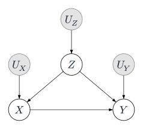
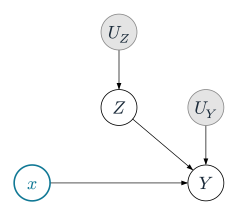
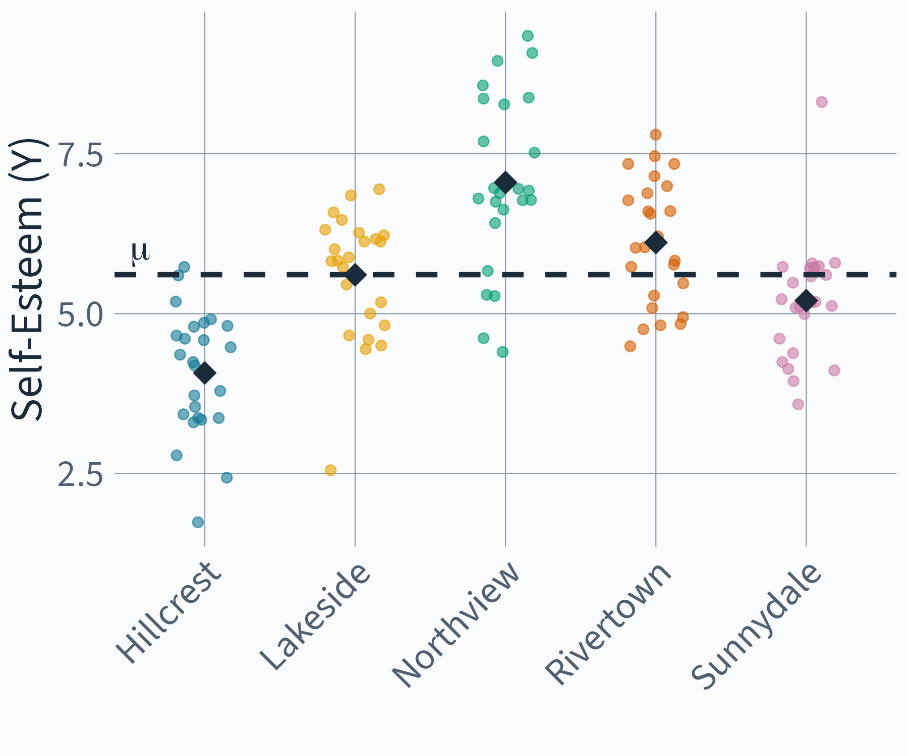
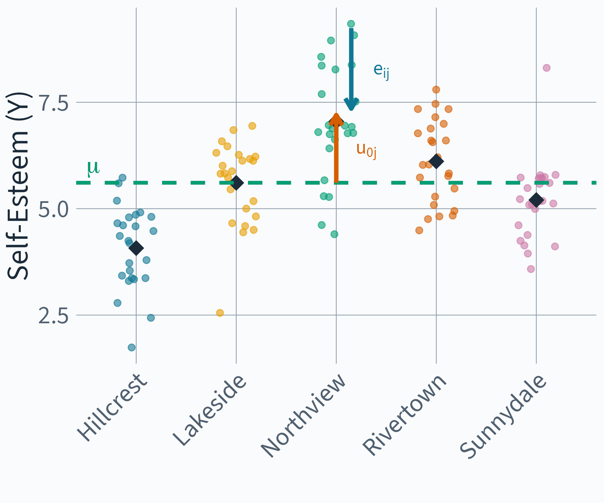
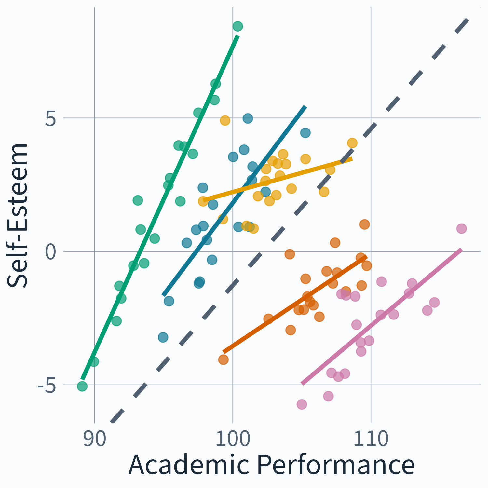
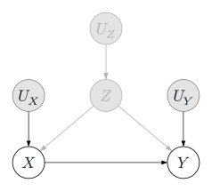
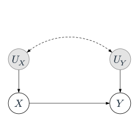
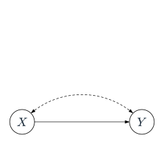
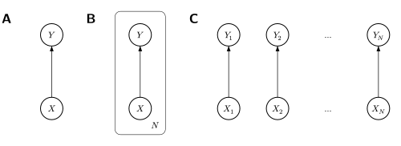
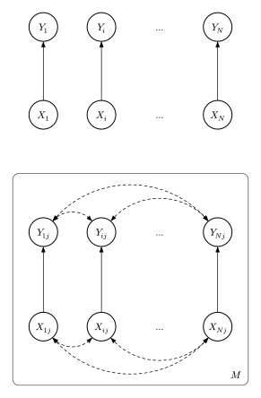

# Day 2 {.section-slide}

::: {.notes}
Welcome back. Yesterday: DAGs, d-separation, do-operator, the Causal Quartet.
Today: what happens when the effect isn't the same for everyone?
:::

## {background-image="images/illustrations-custom/roadmap-step-0.svg" background-size="contain"}

::: {.citation-lower-left}
Adapted from @watsonNewDirectionsHuman2025 [fig. 1]
:::

::: {.notes}
Step 0: Theorize Causal Explanations.
"Causal inference begins with theory, not data."
You already have domain knowledge — you study science, you know how Open Data, Rigour, Field, Novelty, and Citations might relate.
Yesterday you used that knowledge implicitly when you discussed kidney stones and the quartet. Today we make it explicit.
Running example: Does sharing data openly lead to more citations?
:::

## What do we know about Open Science? {.v-center}

::: {.theory-table}

| Variable | What the literature tells us |
|---|---|
| **Open Data** | Incentives and mandates drive sharing [@woodsIncentivisingResearchData2022] |
| **Citations** | Data sharing associated with citation advantage [@piwowarSharingDetailedResearch2007] |
| **Reproducibility** | Open data enables verification — but evidence is mixed [@hardwickeAnalyticReproducibilityArticles2021] |
| **Published** | Journal mandates link data sharing to publication [@ross-hellauerTIER2EnhancingTrust2022] |
| **Rigour** | Peer review quality varies substantially [@goodmanManuscriptQualityPeer1994] |
| **Novelty** | Novel contributions get reused and cited more |
| **Data Reuse** | Reuse of shared data leads to citation of originals |
| **Field** | Citation norms and data sharing culture differ across disciplines [@waltmanFieldNormalizationScientometric2019] |

:::

::: {.citation-lower-left}
@klebelIntroductionCausalityScience2024
:::

::: {.notes}
Step 0 in practice — we read the literature and identify the variables that might matter.
No arrows yet. Just the pieces on the table.
This is what humans are good at — domain expertise, reading papers, knowing the field.
The DAG comes in Step 3.
All of this from Klebel & Traag (2024) who built this exact example.
:::

## {background-image="images/illustrations-custom/roadmap-step-1.svg" background-size="contain"}

::: {.citation-lower-left}
Adapted from @watsonNewDirectionsHuman2025 [fig. 1]
:::

::: {.notes}
Step 1: Define the Causal Question.
Exposure: Open Data (binary — shared or not). Outcome: Citations (count).
Watson et al.: specify where on the continuum from well-defined intervention to realized exposure.
Open Data is closer to a realized exposure — we can't cleanly randomize it, but we can ask retrospectively whether sharing caused more citations.
:::

## Define the Causal Question {.v-center}

> Does sharing data openly cause more citations?

:::: {.columns style="margin-top: 1.5em; align-items: center !important;"}
::: {.column width="38%" style="text-align: center;"}
[**Exposure**]{style="color: var(--iqb-muted); font-size: 0.8em;"}

[**Open Data**]{style="font-size: 1.3em; color: var(--accent); white-space: nowrap;"}

[binary: shared or not]{style="color: var(--iqb-muted); font-size: 0.75em; white-space: nowrap;"}
:::
::: {.column width="24%" style="text-align: center; padding-top: 0.8em;"}

```{=html}
<svg width="120" height="40" viewBox="0 0 120 40" style="display: block; margin: 0 auto;">
  <defs>
    <marker id="arrowhead" markerWidth="10" markerHeight="7" refX="9" refY="3.5" orient="auto">
      <polygon points="0 0, 10 3.5, 0 7" fill="#9ab3be"/>
    </marker>
  </defs>
  <line x1="10" y1="20" x2="100" y2="20" stroke="#9ab3be" stroke-width="3" marker-end="url(#arrowhead)"/>
</svg>
```

:::
::: {.column width="38%" style="text-align: center;"}
[**Outcome**]{style="color: var(--iqb-muted); font-size: 0.8em;"}

[**Citations**]{style="font-size: 1.3em; color: var(--accent);"}

[count]{style="color: var(--iqb-muted); font-size: 0.75em;"}
:::
::::

::: {.citation-lower-left}
@klebelIntroductionCausalityScience2024
:::

::: {.notes}
We pick one question from the system. Not "how does science work" — that's too broad.
Exposure is binary: did you share your data or not?
Outcome is continuous: how many citations?
This is a realized exposure, not a well-defined intervention — we can't randomize data sharing. Journals mandate it, rigorous researchers self-select into it.
But we can still ask the causal question and be explicit about our assumptions.
:::

## {background-image="images/illustrations-custom/roadmap-step-2.svg" background-size="contain"}

::: {.citation-lower-left}
Adapted from @watsonNewDirectionsHuman2025 [fig. 1]
:::

::: {.notes}
Step 2: Specify the Theoretical Estimand.
Before we draw a single arrow — what do we WANT to know?
ψ = E[Y_i(open) - Y_i(not open)] — the average causal effect of sharing data on citations, in the population of published studies.
Two components (Lundberg et al. 2021): the unit-specific quantity (individual causal effect) and the target population (published studies).
Notice: no DAG yet, no model yet. The theoretical estimand is prior to the graph.
Maybe the effect differs by field — psychology vs physics have very different data-sharing norms. That would be a CATE. We'll come back to this after the exercise.
:::

## Specify the Theoretical Estimand {.v-center}

:::: {style="text-align: center;"}

[Individual causal effect]{style="color: var(--iqb-muted); font-size: 0.7em; text-transform: uppercase; letter-spacing: 0.05em;"}

$$\text{ITE} \;=\; \tau_i \;=\; Y_i(\text{open}) \;-\; Y_i(\text{not open})$$

::: {.fragment style="margin-top: -0.2em;"}
[$\downarrow$ average over population]{style="color: var(--iqb-muted); font-size: 0.7em;"}

$$\text{ATE} \;=\; \tau \;=\; \mathbb{E}\big[Y_i(\text{open}) \;-\; Y_i(\text{not open})\big]$$
:::

::::

::: {.fragment}
:::: {.columns style="margin-top: 0.5em;"}
::: {.column width="50%" style="text-align: center; border-right: 2px solid var(--iqb-muted); padding-right: 1em;"}
[**Unit-specific quantity**]{style="color: var(--accent); font-size: 0.85em;"}

[How many more citations if *this* study shared data?]{style="font-size: 0.8em;"}
:::
::: {.column width="50%" style="text-align: center; padding-left: 1em;"}
[**Target population**]{style="color: var(--accent); font-size: 0.85em;"}

[All published studies? Only in psychology?]{style="font-size: 0.8em;"}
:::
::::
:::

::: {.citation-lower-left}
Lundberg, Johnson & Stewart (2021)
:::

::: {.notes}
No DAG yet, no model yet. The theoretical estimand comes BEFORE the graph.
Lundberg et al. (2021): most studies never state their target quantity — they jump straight to a regression.
Two components: what causal contrast at the individual level, and over whom do you average?
The population choice matters — conditioning on "published" is itself a collider issue (Klebel & Traag show this in their case study C).
Maybe the effect differs by field — psychology vs physics have very different data-sharing norms. That would be a CATE. We come back to this after the exercise when we talk about heterogeneity.
:::

## {background-image="images/illustrations-custom/roadmap-step-3.svg" background-size="contain"}

::: {.citation-lower-left}
Adapted from @watsonNewDirectionsHuman2025 [fig. 1]
:::

::: {.notes}
Step 3: Draw a Causal DAG.
"Now we encode our assumptions in a graph."
This is what you're about to do in the exercise — draw the DAG for the Open Science system.
8 variables: Novelty, Rigour, Open Data, Published, Data Reuse, Reproducibility, Field, Citations.
Your arrows are your assumptions. Different pairs will draw different DAGs — that's the point.
The exercise script walks you through Steps 3-6 of the roadmap. Let's go.
:::

## Exercise: DAGitty {.center .section-slide}

::: {.citation-lower-left}
@textorRobustCausalInference2016; @klebelIntroductionCausalityScience2024
:::

::: {.notes}
Steps 0-2 are done — you have the question, the estimand, and the variables.
Now you walk Steps 3-6 hands-on: draw the DAG, assess assumptions, find the adjustment set, estimate.
The script maps each step to the roadmap.
:::

## {.center}

[moritzketzer.github.io/iqb-workshop](https://moritzketzer.github.io/iqb-workshop/){target="_blank"}

Open `dagitty-open-science.R`

Breakout rooms in pairs (~30 min), then 5 min break before debrief.

::: {.notes}
Exercise: "Does Open Science lead to more citations?" Build a DAG with 8 variables in dagitty.net.
The script walks them through roadmap Steps 3-6.
Step 3: Draw the DAG — 8 nodes, discuss arrows with partner. No right answer.
Step 4: Set exposure/outcome, experiment with adjusting — watch bias appear/disappear.
Step 5: Load DAG into R, adjustmentSets() — this IS the empirical estimand.
Step 6: Simulate data, compare naive vs DAG-informed vs causal salad.
Submit DAG + bias plot to gallery.
Walk around, help with dagitty.net UI. Key friction: exact node names so R code works.
:::

## {background-image="images/illustrations-custom/roadmap-step-7.svg" background-size="contain"}

::: {.citation-lower-left}
Adapted from @watsonNewDirectionsHuman2025 [fig. 1]
:::

::: {.notes}
Step 7: Interpret with Transparency.
Welcome back. You've walked Steps 3-6 — drew a DAG, found adjustment sets, estimated effects.
Now: what do your assumptions mean for interpretation?
Different pairs drew different DAGs → different adjustment sets → different estimates. All from the same data.
The estimate is only as good as the DAG. If exchangeability doesn't hold — unmeasured confounders — the estimate is biased.
:::

## {background-iframe="http://your-server-ip/gallery" background-interactive="true"}

::: {.notes}
Gallery — live view of submitted DAGs and bias plots. Auto-refreshes every 5 seconds.
Scroll through, discuss interesting differences between pairs.
Key question: where did DAGs differ? Which arrows were controversial?
Different arrows → different adjustment sets → different conclusions from the same data.
:::

## {background-image="images/plots/gallery-example-combined.png" background-size="contain-padded-2"}

::: {.notes}
Example pair result. DAG-informed adjustment (Field + Rigour) recovers true effect (~5.4).
Naive overestimates (confounding), causal salad underestimates (mediator bias via Data Reuse).
The DAG tells you what to control for — and what not to.
This is Step 7 in action: interpreting with transparency means stating your assumptions and showing what happens when they differ.
:::

## {background-image="images/illustrations-custom/roadmap-step-8.svg" background-size="contain"}

::: {.citation-lower-left}
Adapted from @watsonNewDirectionsHuman2025 [fig. 1]
:::

::: {.notes}
Step 8: Revisit Theory with Evidence.
Does the estimate align with what theory predicted? If not — revise the DAG, revise the theory.
The roadmap is a cycle, not a one-shot pipeline.
You just completed one full pass through the roadmap. Now we go deeper.
:::

## {background-image="images/illustrations-custom/roadmap-step-ibe.svg" background-size="contain"}

::: {.citation-lower-left}
Adapted from @watsonNewDirectionsHuman2025 [fig. 1]
:::

::: {.notes}
The whole roadmap is inference to the best explanation.
You never prove causation — you build the strongest case you can, then stress-test it.
Every pass through the roadmap sharpens your causal story.
:::

# Heterogeneity {.section-slide}

::: {.notes}
The effect can vary — and the DAG alone won't tell us.
Effects vary across people, across groups, across time.
The ATE averages over all of that. Sometimes that's fine. Sometimes it's misleading.
:::

## {background-image="images/plots/gelman-quartet-variation.png" background-size="contain-padded-6"}

:::: {.citation-lower-left}
@gelmanCausalQuartetsDifferent2023
::::

::: {.notes}
Reveal: four panels, all with ATE = 0.1 (dashed line).
Each dot is one person's true individual treatment effect — the thing we can't observe.
Top-left: Constant — everyone gets ~0.1. The implicit default.
Top-right: Low variation — always positive, mild spread. Plausible.
Bottom-left: High variation — some people are HARMED. Average hides conflict.
Bottom-right: Occasional large effects — zero for most, huge for a few. Minority drives ATE.
Walk through each. "Which feels most realistic for an educational intervention?"
:::

## A Linear SCM with Interaction

::::: {.columns}
:::: {.column width="50%"}

### Structural Equations

$$
\begin{aligned}
Z &= U_Z \\
X &= \beta^{XZ} Z + U_X \\
Y &= \beta^{YX} X + \beta^{YZ} Z + \textcolor{#D55E00}{\beta^{YXZ} XZ} + U_Y
\end{aligned}
$$

### Distributional Assumptions

$$
\begin{pmatrix} U_Z \\ U_X \\ U_Y \end{pmatrix} \sim \mathcal{N}\left(\begin{pmatrix} 0 \\ 0 \\ 0 \end{pmatrix}, \begin{pmatrix} \sigma^2_Z & 0 & 0 \\ 0 & \sigma^2_X & 0 \\ 0 & 0 & \sigma^2_Y \end{pmatrix}\right)
$$
::::

:::: {.column width="50%"}
{.absolute top="30" right="-130" height="400"}
::::
:::::

## Graph Surgery: Interaction Case

::::: {.columns}
:::: {.column width="50%"}

### Structural Equations

$$
\begin{aligned}
Z &= U_Z \\
X &= \color{#107895}{x} \\
Y &= \beta^{YX} \textcolor{#107895}{x} + \beta^{YZ} Z + \textcolor{#D55E00}{\beta^{YXZ} \textcolor{#107895}{x} Z} + U_Y
\end{aligned}
$$

### Distributional Assumptions

$$
\begin{pmatrix} U_Z \\ \textcolor{lightgray}{U_X} \\ U_Y \end{pmatrix} \sim \mathcal{N}\left(\begin{pmatrix} 0 \\ \textcolor{lightgray}{0} \\ 0 \end{pmatrix}, \begin{pmatrix} \sigma^2_Z & 0 & 0 \\ 0 & \textcolor{lightgray}{\sigma^2_X} & 0 \\ 0 & 0 & \sigma^2_Y \end{pmatrix}\right)
$$
::::

:::: {.column width="50%"}
{.absolute top="30" right="-130" height="400"}
::::
:::::

## {background-image="images/plots/interaction-cate-slopes.png" background-size="contain-padded-6"}

::: {.notes}
Same visual technique — color by Z, look within strata.
But now the lines AREN'T parallel. They fan out.
Low Z (purple): flat or negative slope. High Z (yellow): steep positive slope.
The dashed line is the average — the ATE. It hides the variation.
Same DAG. Same do-operator. But the answer depends on Z.
:::

## {.center}

$$
CATE = \mathbb{E}[Y \mid do(X = x), Z = z] - \mathbb{E}[Y \mid do(X = x'), Z = z]
$$

## {.center}

$$
CATE = \textcolor{#107895}{\beta^{YX}} + \textcolor{#D55E00}{\beta^{YXZ}} z
$$

| Estimand |  |  |
|---|---|---|
| **ATE** | Average over all $Z$ | $\textcolor{#107895}{\beta^{YX}}$ |
| **CATE** | At a specific $Z = z$ | $\textcolor{#107895}{\beta^{YX}} + \textcolor{#D55E00}{\beta^{YXZ}} z$ |

::: {.notes}
Now we can name what we saw. The CATE keeps Z visible instead of averaging over it.
The ATE is the average of all CATEs, weighted by the distribution of Z.
At Z = 0, they coincide. Away from zero, they diverge.
The ATE of β^YX hides the fact that some people are harmed and others helped a lot.
:::

## {background-image="images/plots/gelman-quartet-heterogeneous.png" background-size="contain-padded-6"}

:::: {.citation-lower-left}
@gelmanCausalQuartetsDifferent2023
::::

::: {.notes}
Earlier we saw the same ATE hiding four patterns of individual effects — random variation around the average.
Now the variation is systematic. The causal effect changes as a function of a covariate — that's exactly the CATE we just defined.
Top-left: Linear interaction — this IS the β^YX + β^YXZ·z model we just worked through. The line we drew.
Top-right: No effect then increase — treatment only kicks in above a threshold. A linear model would miss this.
Bottom-left: Plateau — effect saturates, ceiling on what treatment can do.
Bottom-right: Sweet spot — only works for intermediate values. Nothing at extremes.
All four produce the same ATE. A linear interaction model would fit only the first.
"Which shape best describes your intervention?"
:::

## {background-image="images/plots/categorical-cate-schools.png" background-size="contain-padded-6"}

::: {.notes}
So far Z was continuous. But the most common source of heterogeneity in your data isn't continuous — it's grouping.
Students in schools. Each school gets its own regression line — its own effect of X on Y.
Some steep, some flat, one slightly negative. The dashed line is the ATE — the average across all schools.
This is the same fanning-slopes pattern, just discrete.

Key intuition: MLM is the inverse of conditioning.
Conditioning = filter to one school, narrow the distribution.
Pooling = combine across schools, expand it back.
The population (schools) is implicit in the DAG — not drawn, but structurally present.
:::

## {.center}

| Estimand | Population | Averages over |
|---|---|---|---|
| **ATE** | $= E[\beta_j]$ | All schools | School differences |
| **CATE(j)** | $= \beta_j$ | School $j$ | Nothing — school-specific |

::: {.notes}
Same framework as before. The ATE averages over all schools.
The CATE keeps the school visible. Some schools show strong effects, others nothing.
The ATE hides that — same story as continuous Z, just discrete.
:::

## {.center}

{height="550"}

Backdoor criterion: condition on Z. Done?

::: {.fragment}
But Z = school is not a variable — it's a cluster.
:::

::: {.notes}
Callback to the DAG they already know.
d-separation says block the path through Z → condition on school.
But what does "condition on school" mean in a regression?
School isn't a column in the data — it's a grouping structure that generates shared variation in X and Y.
One circle hides multiple causal pathways.
:::

# What's Inside Z? {.section-slide}

# Multilevel Models {.section-slide}

## {.centered-columns}

::::: {.columns}
:::: {.column width="55%"}

::::

:::: {.column style="width:45%; text-align:center;"}
[Random Intercept Model]{.accent-heading}

$$
\begin{aligned}
y_{ij} &= \eta_{0j} + e_{ij} \\
\eta_{0j} &= \mu + u_{0j}
\end{aligned}
$$
::::
:::::

## {.centered-columns}

::::: {.columns}
:::: {.column width="55%"}

::::

:::: {.column style="width:45%; text-align:center;"}
[Random Intercept Model]{.accent-heading}

$$
\begin{aligned}
y_{ij} &= \mu + u_{0j} + e_{ij}
\end{aligned}
$$
::::
:::::

## {.centered-columns}

::::: {.columns}
:::: {.column width="55%"}

::::

:::: {.column style="width:45%; text-align:center;"}
[Random Intercept Model]{.accent-heading}

$$
\begin{aligned}
y_{ij} &= \color{#009E73}{\mu}\color{black} + \color{#D55E00}{u_{0j}}\color{black} + \color{#107895}{e_{ij}}\color{black}
\end{aligned}
$$
::::
:::::

## Exercise: What Do the Error Terms Mean? {.center .section-slide}

::: {.notes}
Pair discussion, ~5 min. Just had the random intercept equation — now make them think causally about it.
:::

## {.v-center}

Look at the Random Intercept Model:

::: {style="margin: -0.3em 0 -0.3em 0; display:block;"}
$$
y_{ij} = \color{#009E73}{\mu}\color{black} + \color{#D55E00}{u_{0j}}\color{black} + \color{#107895}{e_{ij}}\color{black}
$$
:::

Discuss with your neighbor:

1. What do $\color{#D55E00}{u_{0j}}$ and $\color{#107895}{e_{ij}}$ represent from a **Structural Causal Model** perspective?
2. Can you name **concrete examples** of what these unobserved causes could be?
3. Try to sketch the **simplest possible DAG** for this model — one observed node, two latent error nodes.
4. What does it mean that we split "unobserved causes" into a **between-cluster** and a **within-cluster** component?

::: {.notes}
~5 min pair discussion, ~5 min debrief.
Goal: bridge statistical notation ↔ causal thinking. Even the simplest MLM embeds causal assumptions.
u₀ⱼ = unobserved cluster-level causes (school resources, culture, neighborhood).
eᵢⱼ = unobserved individual-level causes (motivation, family, prior knowledge).
Splitting error into two levels = assuming two distinct sets of unobserved causes.
The DAG they should arrive at: Y ← u₀ⱼ, Y ← eᵢⱼ — one observed node, two latent nodes. That's already a causal model.
:::

## {background-image="images/plots/bflpe-homogeneous.png" background-size="contain-padded-7"}

:::: {.citation-lower-left}
[Illustration of the Big Fish Little Pond Effect based on simulated data, cf. @marshBigfishlittlepondeffectStandsCritical2008]
::::

::: {.notes}
BFLPE: self-concept depends on own ability AND peers’ ability.
Big fish in little pond → higher self-concept.

Between: selective school → lower self-esteem (negative).
Within: outperform peers → higher self-esteem (positive).
Sign flip between levels.
:::

## {background-image="images/plots/bflpe-heterogeneous.png" background-size="contain-padded-7"}

:::: {.citation-lower-left}
[Illustration of the Big Fish Little Pond Effect based on simulated data, cf. @marshBigfishlittlepondeffectStandsCritical2008]
::::

::: {.notes}
Previous was stylized — in practice, expect effect heterogeneity across schools.
:::

## {background-image="images/plots/bias-multilevel.png" background-size="contain-padded-7"}

:::: {.citation-lower-left}
[Illustration of the Big Fish Little Pond Effect based on simulated data, cf. @marshBigfishlittlepondeffectStandsCritical2008]
::::

::: {.notes}
Red = naive OLS (ignoring clusters).
Grey dashed = true average within effect.
Black dashed = between effect.
Gap red↔grey = bias. OLS pulled toward between (negative).
:::

## {.centered-columns}

::::: {.columns}
:::: {.column width="50%"}

::::

:::: {.column style="width:50%; text-align:center;"}
[Multi-Level Notation]{.accent-heading}

$$
\begin{aligned}
y_{ij} &= \eta_{0j} + \eta_{1j}x_{ij} + e_{ij} \\
\eta_{0j} &= \mu + u_{0j} \\
\eta_{1j} &= \beta + u_{1j}
\end{aligned}
$$
::::
:::::

::: {.notes}
Left: per-school slopes (effect heterogeneity).
Right: equations. u_{1j} = random slope, u_{0j} = random intercept.
:::

:::: {style="font-size: 140%; text-align: center;"}
## Multi-Level Regression Notation {.center visibility="hidden"}

$$
\begin{aligned}
y_{ij} &= \eta_{0j} + \eta_{1j}x_{ij} + e_{ij} \\
\eta_{0j} &= \mu + u_{0j} \\
\eta_{1j} &= \beta + u_{1j}
\end{aligned}
$$
::::

:::: {style="font-size: 140%; text-align: center;"}
## Multi-Level Regression Notation {.center}

$$
\begin{aligned}
y_{ij} &= \eta_{0j} + \eta_{1j}x_{ij} + e_{ij} \\
\eta_{0j} &= \mu + u_{0j} \\
\eta_{1j} &= \beta + u_{1j}
\end{aligned}
$$
::::

:::: {style="font-size: 140%; text-align: center;"}
## Mixed-Model Notation {.center}

$$
y_{ij} = \color{#D55E00}(\mu + u_{0j})\color{black} + \color{#D55E00}(\beta + u_{1j})\color{black} x_{ij} + e_{ij}
$$
::::

:::: {style="font-size: 140%; text-align: center;"}
## Mixed-Model Notation {.center}

$$
y_{ij} = \mu + \beta x_{ij} + u_{1j}x_{ij} + u_{0j} + e_{ij}
$$
::::

:::: {style="font-size: 140%; text-align: center;"}
## Distributional Assumptions {.center}

$$
\begin{aligned}
\begin{bmatrix}
u_{0j}\\
u_{1j}
\end{bmatrix} &\sim N\left (\begin{bmatrix}
0\\
0
\end{bmatrix},
\begin{bmatrix}
\psi_{11} \\
\psi_{21} & \psi_{22}
\end{bmatrix}\right ) \\
\begin{bmatrix}
e_{ij}
\end{bmatrix} &\sim N(0,\sigma^2_e)
\end{aligned}
$$
::::

# Common Path Diagrams for Multilevel Models {.section-slide}

##  {background-image="images/path-diagrams/curran-bauer.svg" background-size="contain-padded-6"}

:::: {.citation-lower-left}
[adapted from @curranBuildingPathDiagrams2007]
::::

##  {background-image="images/path-diagrams/mplus.svg" background-size="contain-padded-6"}

:::: {.citation-lower-left}
[adapted from @muthenMplusUsersGuide2017]
::::

##  {background-image="images/path-diagrams/extended-ram.svg" background-size="contain-padded-6"}

:::: {.citation-lower-left}
[adapted from @mehtaPeopleAreVariables2005]
::::

##  {background-image="images/path-diagrams/rabe-hesketh-concise-together.svg" background-size="contain-padded-6"}

:::: {.citation-lower-left}
[adapted from @skrondalGeneralizedLatentVariable2004]
::::

# None of them clearly map on to the formal class of DAGs {background-color="#D55E00"}

::: {.notes}
Current MLM path diagram conventions are not formal DAGs.
Useful for visualization, but no intervention semantics.
Remember earlier: DAGs have independent errors, DAMGs allow correlated errors.
Multilevel random effects are shared unmeasured causes across units within a cluster.
That's exactly what the bidirected edge encodes. Every multilevel model implies a DAMG.
:::

## {background-color="#107895"}

:::: {style="font-size: 170%;"}
$$
\begin{array}{c}
\text{(Multi-level) SCM} = (\mathcal S, \mathcal P, \mathcal G)
\end{array}
$$

::: center
$\mathcal S$ = Set of (Multilevel) Structural Equations

$\mathcal P$ = Probability distribution over the exogenous variables

$\mathcal G$ = Graph (DAG or DAMG)
:::
::::

::: {.notes}
Bridge: MLM = SEM = parametric SCM.
Add SCM semantics → rigorous causal multilevel framework.
:::

# What is a DAMG?

## Back to our example

::::: {.columns}
:::: {.column width="50%"}

### Structural Equations

$$
\begin{aligned}
Z &= U_Z \\
X &= \beta^{XZ} Z + U_X \\
Y &= \beta^{YX} X + \beta^{YZ} Z + U_Y
\end{aligned}
$$

### Distributional Assumptions

$$
\begin{pmatrix} U_Z \\ U_X \\ U_Y \end{pmatrix} \sim \mathcal{N}\left(\begin{pmatrix} 0 \\ 0 \\ 0 \end{pmatrix}, \begin{pmatrix} \sigma^2_Z & 0 & 0 \\ 0 & \sigma^2_X & 0 \\ 0 & 0 & \sigma^2_Y \end{pmatrix}\right)
$$
::::

:::: {.column width="50%"}
{.absolute top="30" right="5" height="400"}
::::
:::::

## What if Z is unobserved?

::::: {.columns}
:::: {.column width="50%"}

### Structural Equations

$$
\begin{aligned}
\color{lightgray} Z &\color{lightgray}= U_Z \\
X &= \beta^{XZ} \textcolor{lightgray}{Z} + U_X \\
Y &= \beta^{YX} X + \beta^{YZ} \textcolor{lightgray}{Z} + U_Y
\end{aligned}
$$

### Distributional Assumptions

$$
\begin{pmatrix} \textcolor{lightgray}{U_Z} \\ U_X \\ U_Y \end{pmatrix} \sim \mathcal{N}\left(\begin{pmatrix} \textcolor{lightgray}{0} \\ 0 \\ 0 \end{pmatrix}, \begin{pmatrix} \textcolor{lightgray}{\sigma^2_Z} & 0 & 0 \\ 0 & \sigma^2_X & 0 \\ 0 & 0 & \sigma^2_Y \end{pmatrix}\right)
$$
::::

:::: {.column width="50%"}
{.absolute top="30" right="5" height="400"}
::::
:::::

::: {.notes}
The SCM is unchanged. Z is still endogenous — it still has its own equation, it still causes X and Y.
But we can no longer condition on it. Grey = unobserved, not absent.
The confounding path through Z is still there, just unblockable.
:::

## Directed Acyclic Mixed Graphs

::::: {.columns}
:::: {.column width="50%"}

### Structural Equations

$$
\begin{aligned}
X &= E^X \\
Y &= \beta^{YX} X + E^Y
\end{aligned}
$$

### Distributional Assumptions

$$
\begin{pmatrix} E^X \\ E^Y \end{pmatrix} \sim \mathcal{N}\left(\begin{pmatrix} 0 \\ 0 \end{pmatrix}, \begin{pmatrix} \sigma^2_X & \textcolor{#D55E00}{\sigma_{XY}} \\ \textcolor{#D55E00}{\sigma_{XY}} & \sigma^2_Y \end{pmatrix}\right)
$$
::::

:::: {.column width="50%"}
{.absolute top="30" right="5" height="400"}
::::
:::::

::: {.notes}
Same confounding, no explicit U.
Correlated errors = bidirected edge.
DAMG = Directed Acyclic Mixed Graph.
:::

## Directed Acyclic Mixed Graphs

::::: {.columns}
:::: {.column width="50%"}

### Structural Equations

$$
\begin{aligned}
X &= E^X \\
Y &= \beta^{YX} X + E^Y
\end{aligned}
$$

### Distributional Assumptions

$$
\begin{pmatrix} E^X \\ E^Y \end{pmatrix} \sim \mathcal{N}\left(\begin{pmatrix} 0 \\ 0 \end{pmatrix}, \begin{pmatrix} \sigma^2_X & \textcolor{#D55E00}{\sigma_{XY}} \\ \textcolor{#D55E00}{\sigma_{XY}} & \sigma^2_Y \end{pmatrix}\right)
$$
::::

:::: {.column width="50%"}
{.absolute top="30" right="5" height="400"}
::::
:::::

::: {.notes}
Same confounding, no explicit U.
Correlated errors = bidirected edge.
DAMG = Directed Acyclic Mixed Graph.
:::

## Multi-level Equations {.center}

$$
\begin{aligned}
\color{#D55E00} X_{ij} &\color{#D55E00}= \eta_{j}^{X\mu} + E_{ij}^{X} \\
Y_{ij} &= \eta_{j}^{Y\mu} + \eta_{j}^{YX} X_{ij} + E_{ij}^{Y} \\
\\
\color{#D55E00} \eta_{j}^{X\mu} &\color{#D55E00} = \mu^{X} + U_{j}^{X\mu} \\
\eta_{j}^{Y\mu} &= \mu^{Y} + U_{j}^{Y\mu} \\
\eta_{j}^{YX} &= \beta^{YX} + U_{j}^{YX}
\end{aligned}
$$

## Mixed-Model Form = Structural Form {.center}

$$
\begin{aligned}
X_{ij} &= \mu^{X} + U_{j}^{X\mu} + E_{ij}^{X} \\
Y_{ij} &= (\mu^{Y} + U_{j}^{Y\mu}) + (\beta^{YX} + U_{j}^{YX})X_{ij} + E_{ij}^{Y}
\end{aligned}
$$

## Mixed-Model Form = Structural Form {.center}

$$
\begin{aligned}
X_{ij} &= \mu^{X} + U_{j}^{X\mu} + E_{ij}^{X} \\
Y_{ij} &= \mu^{Y} + \color{#D55E00}\beta^{YX}\color{black} X_{ij} + U_{j}^{YX}X_{ij} + U_{j}^{Y\mu} + E_{ij}^{Y}
\end{aligned}
$$

# From Single Level to Multi-Level Graphs {.section-slide}

## Plate Notation {.center}



::: {.notes}
Panel A: plain single-level DAG. Panel B: wrap in a plate — compact shorthand for "repeat N times." Panel C: what the plate actually means when you expand it.
:::

## From Independent to Dependent Units {.center}



::: {.notes}
Top: expanded single-level graph — units are independent copies. Bottom: add cluster subscripts, dependence arrows between units in the same cluster, and an M plate around the whole thing. This is the multi-level DAG.
:::

# Multi-Level DA(M)G's {.section-slide}

##  {.center}

$$
\begin{aligned}
Y_{\color{#D55E00}1} &= \mu^Y + \beta^{YX} X_{1} + U^{YX} X_{1} + U^{Y\mu} + E_{1}^Y \\
X_{\color{#D55E00}1} &= \mu^X + U^{X\mu} + E_{1}^X \\
Y_{\color{#D55E00}2} &= \mu^Y + \beta^{YX} X_{2} + U^{YX} X_{2} + U^{Y\mu} + E_{2}^Y \\
X_{\color{#D55E00}2} &= \mu^X + U^{X\mu} + E_{2}^X \\
Y_{\color{#D55E00}3} &= \mu^Y + \beta^{YX} X_{3} + U^{YX} X_{3} + U^{Y\mu} + E_{3}^Y \\
X_{\color{#D55E00}3} &= \mu^X + U^{X\mu} + E_{3}^X
\end{aligned}
$$

##  {.center}

$$
\begin{aligned}
Y_{1} &= \color{#D55E00}f_{Y1}\color{black}(X_{1}, U^{Y\mu}, U^{YX}, E_{1}^Y) \\
X_{1} &= \color{#D55E00}f_{X1}\color{black}(U^{X\mu}, E_{1}^X) \\
Y_{2} &= \color{#D55E00}f_{Y2}\color{black}(X_{2}, U^{Y\mu}, U^{YX}, E_{2}^Y) \\
X_{2} &= \color{#D55E00}f_{X2}\color{black}(U^{X\mu}, E_{2}^X) \\
Y_{3} &= \color{#D55E00}f_{Y3}\color{black}(X_{3}, U^{Y\mu}, U^{YX}, E_{3}^Y) \\
X_{3} &= \color{#D55E00}f_{X3}\color{black}(U^{X\mu}, E_{3}^X)
\end{aligned}
$$

## Distributional Assumptions {.center}

$$
\begin{aligned}
\begin{bmatrix}
U_{j}^{X\mu}\\
U_{j}^{Y\mu}\\
U_{j}^{YX}
\end{bmatrix}
&\sim N
\left (
\begin{bmatrix}
0\\
0\\
0
\end{bmatrix},
\begin{bmatrix}
\psi_{U_{j}^{X\mu}} &  &  \\
\psi_{U_{j}^{X\mu} U_{j}^{Y\mu}} & \psi_{U_{j}^{Y\mu}} &  \\
\psi_{U_{j}^{X\mu} U_{j}^{YX}} & \psi_{U_{j}^{Y\mu} U_{j}^{YX}} & \psi_{U_{j}^{YX}}
\end{bmatrix}
\right ) \\
\begin{bmatrix}
E_{ij}^{X} \\
E_{ij}^{Y}
\end{bmatrix}
&\sim N\left
(\begin{bmatrix}
0\\
0
\end{bmatrix},
\begin{bmatrix}
\sigma^2_{E^X} &  \\
0              & \sigma^2_{E^Y}
\end{bmatrix}\right )
\end{aligned}
$$

## {background-image="images/dags/rules-illustration-plate.svg" background-size="contain-padded-6"}

## {background-image="images/dags/rules-illustration-plate-only.svg" background-size="contain-padded-6"}

## {background-image="images/dags/b-varying-intercept-slope-level-1-endogenous.svg" background-size="contain-padded-6"}

<!--
## Mixed-Model Reduced Form {.center}

$$
\begin{aligned}
X_{ij} &= \mu^{X} + U_{j}^{X\mu} + E_{ij}^{X} \\
Y_{ij} &= \mu^{Y} + \beta^{YX} \color{#D55E00} (\mu^{X} + U_{j}^{X\mu} + E_{ij}^{X}) \color{black} \\
       &+ U_{j}^{YX} \color{#D55E00} (\mu^{X} + U_{j}^{X\mu} + E_{ij}^{X}) \color{black} \\
       &+ U_{j}^{Y\mu} + E_{ij}^{Y}
\end{aligned}
$$
-->

## Mixed-Model Reduced Form {.center}

$$
\begin{aligned}
\mathbb E[Y_{ij} \mid X_{ij} = x_{ij}] &= \underbrace{\color{lightgray}{\mathbb{E}[Y] - \mu^X \cdot \text{slope}}}_{\text{intercept}} + \underbrace{\left(\color{#D55E00}\beta^{YX}\color{black} + \text{bias}\right)}_{\text{slope}} x_{ij}
\end{aligned}
$$

$$
\text{bias} = \frac{
  \color{#D55E00}\psi_{U^{X\mu} U^{Y\mu}} + \mu^X \psi_{U^{X\mu} U^{YX}} + \sigma_{E^X E^Y}
  }{\psi_{U^{X\mu}} + \sigma^2_{E^X}}
$$

## {background-image="images/dags/b-varying-intercept-slope-do-operator.svg" background-size="contain-padded-6"}

## Mixed-Model Interventional Form {.center}

$$
\begin{aligned}
\mathbb E[Y_{ij} \mid do(X_{ij} = x_{ij})] &=
\underbrace{
  \mathbb{E}[Y] - \mu^X \cdot \color{#D55E00}\beta^{YX}\color{black}
  }_{
    \text{intercept}
  } + \underbrace{
    \color{#D55E00}\beta^{YX}\color{black}
  }_{
      \text{slope}
  } x_{ij}
\end{aligned}
$$

<!--
$$
\begin{aligned}
\mathrm{do}(X_{ij}) &= x \\
Y_{ij} &= \mu^{Y} + \color{#D55E00}\beta^{YX}x\color{black} + \color{#D55E00} U_{j}^{YX} x \color{black} + U_{j}^{Y\mu} + E_{ij}^{Y}
\end{aligned}
$$

## Mixed-Model Interventional Form {.center}

$$
\begin{aligned}
\mathrm{do}(X_{ij}) &= x \\
\mathbb E\big[Y_{ij} | \mathrm{do}(X_{ij} = x)\big] &= \mu^{Y} + \color{#D55E00}\beta^{YX}\color{black}x
\end{aligned}
$$
-->

## Group-Mean Centering {.center}

:::: {style="font-size: 200%;"}
$$
X_{ij} - \bar{X}_j
$$
::::

::: {.fragment}
Subtracting the group mean removes $U_j^{X\mu} \approx \bar{X}_j$
:::

## {background-image="images/dags/rules-illustration-plate-only-centering.svg" background-size="contain-padded-6"}

## {background-image="images/dags/rules-illustration-plate-only-mundlak.svg" background-size="contain-padded-6"}

## Multi-level Regression with Group Mean {.center}

:::: {style="font-size: 140%; text-align: center;"}
$$
\begin{aligned}
y_{ij} &= \eta_{0j} + \eta_{1j}x_{ij} + e_{ij} \\
\eta_{0j} &= \mu + \color{#D55E00}\gamma_1 \bar x_j\color{black} + u_{0j} \\
\eta_{1j} &= \beta + \color{#D55E00}\gamma_2 \bar x_j\color{black} + u_{1j}
\end{aligned}
$$
:::

:::: {style="font-size: 120%"}
## Mixed-Model Notation {.center}

$$
y_{ij} = (\mu + \color{#D55E00}\gamma_1 \bar x_j\color{black} + u_{0j}) + (\beta + \color{#D55E00}\gamma_2 \bar x_j\color{black} + u_{1j}) x_{ij} + e_{ij}
$$
::::

:::: {style="font-size: 120%"}
## Mixed-Model Notation {.center}

$$
y_{ij} = \mu + \color{#D55E00}\gamma_1 \bar x_j\color{black} + \beta x_{ij} + \color{#D55E00}\gamma_2 \bar x_j x_{ij}\color{black} + u_{1j}x_{ij} + u_{0j} + e_{ij}
$$
::::

## {background-image="images/dags/rules-illustration-plate-only-confounding-1.svg" background-size="contain-padded-6"}

## {background-image="images/dags/rules-illustration-plate-only-confounding-2.svg" background-size="contain-padded-6"}

# Visualizations of Multilevel Models {background-color="#D55E00"}

# (Parametric) Multilevel Causal Graphs {.section-slide}

# Confounding in Multilevel Settings {.section-slide}

# Variance Heterogeneity {.section-slide}

## Multi-level Location Scale Equations {.center}

$$
\begin{aligned}
X_{ij} &= \eta_{j}^{X\mu} + \color{#D55E00}\eta_{j}^{X\sigma}\color{black} E_{ij}^{X} \\
Y_{ij} &= \eta_{j}^{Y\mu} + \eta_{j}^{YX} X_{ij} + E_{ij}^{Y} \\
\\
\eta_{j}^{X\mu} &= \mu^{X} + U_{j}^{X\mu} \\
\color{#D55E00}\eta_{j}^{X\sigma} &\color{#D55E00}= \sigma^{X} + U_{j}^{X\sigma} \\
\eta_{j}^{Y\mu} &= \mu^{Y} + U_{j}^{Y\mu} \\
\eta_{j}^{YX} &= \beta^{YX} + U_{j}^{YX}
\end{aligned}
$$

## {background-image="images/plots/variance-heterogeneity.png" background-size="contain-padded-6"}

::: {.notes}
HSB data. Boxplots = within-school SES distribution.
Schools vary in spread → exactly what location-scale η^{Xσ}_j captures.
:::

## Distributional Assumptions of Location-Scale Model {.center}

$$
\begin{aligned}
\begin{bmatrix}
U_{j}^{X\mu}\\
\color{#D55E00} U_{j}^{X\sigma}\\
U_{j}^{Y\mu}\\
U_{j}^{YX}
\end{bmatrix}
&\sim N
\left (
\begin{bmatrix}
0\\
0\\
0\\
0
\end{bmatrix},
\begin{bmatrix}
\psi_{U_{j}^{X\mu}} &  &  &  \\
\color{#D55E00} \psi_{U_{j}^{X\mu} U_{j}^{X\sigma}} & \color{#D55E00} \psi_{U_{j}^{X\sigma}} &  &  \\
\psi_{U_{j}^{X\mu} U_{j}^{Y\mu}} & \color{#D55E00} \psi_{U_{j}^{X\sigma} U_{j}^{Y\mu}} & \psi_{U_{j}^{Y\mu}} &  \\
\psi_{U_{j}^{X\mu} U_{j}^{YX}} & \color{#D55E00} \psi_{U_{j}^{X\sigma} U_{j}^{YX}} & \psi_{U_{j}^{Y\mu} U_{j}^{YX}} & \psi_{U_{j}^{YX}}
\end{bmatrix}
\right ) \\
\begin{bmatrix}
E_{ij}^{X} \\
E_{ij}^{Y}
\end{bmatrix}
&\sim N\left
(\begin{bmatrix}
0\\
0
\end{bmatrix},
\begin{bmatrix}
\color{#D55E00}1\color{black} &  \\
0              & \sigma^2_{E^Y}
\end{bmatrix}\right )
\end{aligned}
$$

## {background-image="images/dags/c-varying-intercept-slope-treatment-variance.svg" background-size="contain-padded-6"}

<!-- TODO: add visual slide for intuition? -->

## {background-image="images/dags/c-varying-intercept-slope-treatment-variance-centering-highlighted.svg" background-size="contain-padded-6"}

:::: {.citation-lower-left}
[@chernozhukovAverageQuantileEffects2013; @batesHandlingCorrelationsCovariates2014]
::::

## Exercise: Multilevel Confounding {.center .section-slide}

::: {.notes}
Theory done — now hands-on. Five models, same data, only some recover the true effect.
Key insight: it's the weighting, not the estimation method.
Part 6 (brms) is optional stretch if time allows.
:::

## {.v-center}

Fit progressively complex models on simulated data.
Which ones recover the true causal effect — and why?

Open `multilevel-confounding/multilevel-confounding.R`

~30 min, then debrief.

::: {.notes}
Models A–E take ~20 min. Part 6 (brms distributional model) is stretch — skip if short on time.
Debrief focus: why is FE the most biased? → variance weighting.
:::

## {background-image="images/paper.png" background-size="contain-padded-2"}

## The estimate may be Weighted Least Squares in Disguise

$$
\mathrm{ATE}=\mathbb{E}[\beta^{YX}_j]
\qquad\text{but}\qquad
\beta^{YX}=\mathbb{E}[W_j\,\beta^{YX}_j]
$$

where

$$
W_j \propto \mathrm{Var}(X_{ij}\mid j), \qquad W_j > 0,
$$

if

$$
\mathrm{Cov}\!\left(U^{X\sigma}_j,\; U^{YX}_j\right)\neq 0.
$$

> Clusters with high variance get high weight, and those with low variance get low weight

## With two crossed fixed effects, weights can go negative

$$
\beta^{YX}_{\text{FE}}=\sum_{j,k}W_{jk}\;\beta^{YX}_{jk},
\qquad W_{jk}\lessgtr 0
$$

Previously: $W_j>0$ (unequal but positive). With two crossed grouping factors — school $\times$ cohort, state $\times$ time — weights can flip sign.

> The estimate can have the opposite sign of every cell-specific effect

:::: {.citation-lower-left}
@dechaisemartinTwoWayFixedEffects2020a
::::

::: {.notes}
TWFE is just cross-classified FE — school x cohort structurally identical to state x time.
Nothing inherently dynamic about this; it's a property of crossed fixed effects.
Homogeneous effects → weights irrelevant (weighted avg of identical values).
Heterogeneous effects + imbalanced design → arbitrarily bad.
de Chaisemartin & D'Haultfoeuille (AER 2020): 26 of 100 most-cited AER papers 2015-2019 used TWFE.
:::

## Medicaid expansion and preterm birth

:::: {style="font-size: 130%; margin-top: 1em;"}
| Estimator | Risk Difference |
|:----------|:---------------:|
| TWFE | **+0.12** (harmful) |
| Group-time ATT | **−0.16** (protective) |
| Target trial | **−0.16** (protective) |
::::

Same data. Sign flipped.

:::: {.citation-lower-left}
@goinComparingTwowayFixed2023b
::::

::: {.notes}
Goin & Riddell (Epidemiology 2023) — brought the TWFE literature from econometrics to epidemiology.
Medicaid expansion on preterm birth using National Center for Health Statistics birth records 2011-2016.
TWFE estimated expansion INCREASED preterm birth risk.
All corrected estimators (group-time ATT, cohort ATT, target trial) found protective or null.
Root cause: staggered adoption + heterogeneous/dynamic effects → already-treated states used as controls for newly-treated → contamination → sign flip.
:::

## References {.smaller .scrollable}

::: {#refs}
:::